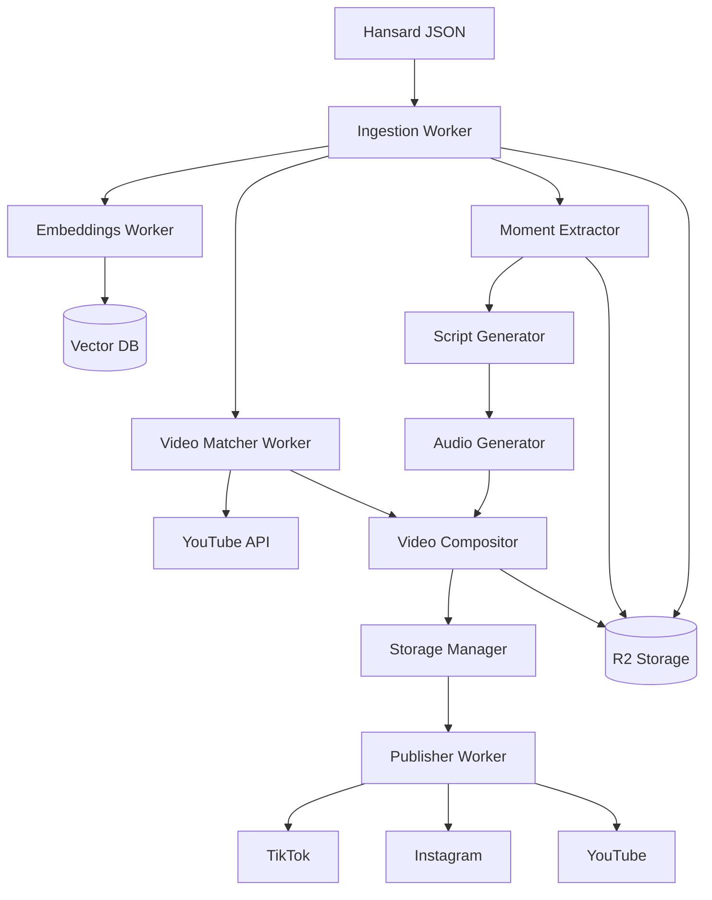

# Capless - Comprehensive Atomic Services Architecture

**Version:** 2.0
**Date:** 2025-10-21
**Status:** Architecture Specification

---

## Executive Summary

Capless is redesigned as a comprehensive atomic services platform for transforming parliamentary proceedings into viral social media content. This architecture emphasizes:

- **Independent atomic services** that can be called standalone
- **Cloudflare Workflows orchestration** for complex pipelines
- **Hybrid state management** using Durable Objects for coordination and Redis for caching
- **Comprehensive ingestion pipeline** supporting both Hansard JSON and YouTube video matching
- **Advanced capabilities** including embeddings, timestamp extraction, and semantic search

---

## 1. Service Inventory

### Core Processing Services

#### 1.1 Ingestion Worker (`capless-ingest`)
**Responsibilities:**
- Parse Hansard JSON transcripts
- Normalize transcript format
- Extract metadata (speakers, topics, dates)
- Generate document embeddings
- Store in R2 and index in vector DB

**Atomic Endpoints:**
```
POST /api/ingest/transcript
  Input: { hansard_json, session_id, date }
  Output: { transcript_id, speakers[], topics[], segment_count }

POST /api/ingest/batch
  Input: { hansard_urls[] }
  Output: { job_id, transcript_ids[] }

GET /api/ingest/status/{job_id}
  Output: { status, processed, total, errors[] }
```

#### 1.2 Video Matcher Worker (`capless-video-matcher`)
**Responsibilities:**
- Match transcripts with YouTube parliamentary videos
- Extract video metadata and duration
- Generate timestamp mappings
- Identify video segments for quotes

**Atomic Endpoints:**
```
POST /api/video/match
  Input: { transcript_id, date, speakers[], youtube_channel_id }
  Output: { video_url, video_id, confidence_score, duration }

POST /api/video/timestamp
  Input: { video_id, quote_text, speaker, approximate_time }
  Output: { start_timestamp, end_timestamp, confidence }

POST /api/video/extract-segment
  Input: { video_url, start_time, end_time }
  Output: { segment_url, duration, format }
```

#### 1.3 Moment Extractor Worker (`capless-moments`)
**Responsibilities:**
- Identify viral-worthy moments from transcripts
- Score moments for virality potential
- Extract context and metadata
- Generate moment embeddings

**Atomic Endpoints:**
```
POST /api/moments/extract
  Input: { transcript_id, criteria?, persona? }
  Output: { moments[], scores[], rankings[] }

POST /api/moments/analyze
  Input: { moment_text, context }
  Output: { virality_score, topics[], emotions[], controversy_level }

GET /api/moments/trending
  Query: { timeframe, limit, min_score }
  Output: { moments[], engagement_metrics[] }
```

#### 1.4 Script Generator Worker (`capless-scripts`)
**Responsibilities:**
- Generate persona-specific commentary scripts
- Maintain voice consistency
- Optimize for platform constraints

**Atomic Endpoints:**
```
POST /api/scripts/generate
  Input: { moment_id, persona, platform, duration_target }
  Output: { script, word_count, estimated_duration, persona_score }

POST /api/scripts/batch
  Input: { moment_id, personas[], platform }
  Output: { scripts[], rankings[] }

POST /api/scripts/refine
  Input: { script, feedback, constraints }
  Output: { refined_script, changes[] }
```

#### 1.5 Audio Generator Worker (`capless-audio`)
**Responsibilities:**
- Text-to-speech conversion
- Voice cloning and persona matching
- Audio optimization and effects

**Atomic Endpoints:**
```
POST /api/audio/generate
  Input: { script, voice_id, speed, emotion }
  Output: { audio_url, duration, waveform_data }

POST /api/audio/clone-voice
  Input: { sample_audio_url, voice_name }
  Output: { voice_id, quality_score }

POST /api/audio/enhance
  Input: { audio_url, effects[] }
  Output: { enhanced_audio_url }
```

#### 1.6 Video Compositor Worker (`capless-video`)
**Responsibilities:**
- Compose final videos with Modal + Remotion
- Apply effects and transitions
- Generate captions and overlays

**Atomic Endpoints:**
```
POST /api/video/compose
  Input: { template, assets, timeline, effects }
  Output: { job_id, estimated_completion }

GET /api/video/status/{job_id}
  Output: { status, progress, preview_url }

POST /api/video/render
  Input: { job_id, format, resolution, platform }
  Output: { video_url, metadata, thumbnails[] }
```

### Intelligence Services

#### 1.7 Embeddings Worker (`capless-embeddings`)
**Responsibilities:**
- Generate semantic embeddings for content
- Manage vector indices
- Enable similarity search

**Atomic Endpoints:**
```
POST /api/embeddings/generate
  Input: { text, model, dimensions }
  Output: { embedding[], model_version }

POST /api/embeddings/search
  Input: { query, index, limit, filters }
  Output: { results[], scores[], metadata[] }

POST /api/embeddings/index
  Input: { documents[], index_name }
  Output: { indexed_count, index_stats }
```

#### 1.8 Analytics Worker (`capless-analytics`)
**Responsibilities:**
- Track engagement metrics
- A/B testing coordination
- Performance analysis

**Atomic Endpoints:**
```
POST /api/analytics/track
  Input: { event, properties, user_id }
  Output: { event_id, timestamp }

GET /api/analytics/report
  Query: { metrics[], timeframe, dimensions[] }
  Output: { data[], aggregations[], insights[] }

POST /api/analytics/experiment
  Input: { test_name, variants[], allocation }
  Output: { variant, experiment_id }
```

### Platform Services

#### 1.9 Publisher Worker (`capless-publisher`)
**Responsibilities:**
- Multi-platform publishing
- Content scheduling
- Platform-specific optimization

**Atomic Endpoints:**
```
POST /api/publish/schedule
  Input: { content_id, platforms[], schedule, options }
  Output: { publication_ids[], scheduled_times[] }

POST /api/publish/immediate
  Input: { content_id, platform, metadata }
  Output: { publication_url, platform_id }

GET /api/publish/status/{publication_id}
  Output: { status, platform_metrics, errors[] }
```

#### 1.10 Storage Manager Worker (`capless-storage`)
**Responsibilities:**
- R2 bucket management
- Asset organization
- CDN cache control

**Atomic Endpoints:**
```
POST /api/storage/upload
  Input: { file, path, metadata, public }
  Output: { url, storage_id, cdn_url }

POST /api/storage/organize
  Input: { pattern, destination, operation }
  Output: { moved_count, new_paths[] }

DELETE /api/storage/cleanup
  Query: { older_than, pattern, dry_run }
  Output: { deleted_count, freed_space }
```

---

## 2. Data Flow Architecture

### Primary Pipeline Flow



### Data Structures

#### Job Object (Durable Object State)
```typescript
interface Job {
  id: string;
  type: 'FULL_PIPELINE' | 'MOMENT_ONLY' | 'VIDEO_ONLY';
  status: JobStatus;

  // Input
  transcript_id?: string;
  hansard_url?: string;
  youtube_url?: string;

  // Processing State
  stages: {
    ingestion: StageStatus;
    moment_extraction: StageStatus;
    video_matching: StageStatus;
    script_generation: StageStatus;
    audio_generation: StageStatus;
    video_composition: StageStatus;
    publication: StageStatus;
  };

  // Outputs
  moments: Moment[];
  selected_moment?: Moment;
  scripts: Script[];
  selected_script?: Script;
  audio_url?: string;
  video_url?: string;
  publication_urls: Record<Platform, string>;

  // Metadata
  created_at: string;
  updated_at: string;
  error_log: Error[];
  retry_count: number;
}

interface Moment {
  id: string;
  quote: string;
  speaker: string;
  topic: string;
  timestamp_start: string;
  timestamp_end: string;
  video_url?: string;
  virality_score: number;
  embedding: number[];
  context: string;
  tags: string[];
}

interface Script {
  id: string;
  moment_id: string;
  persona: Persona;
  text: string;
  duration_estimate: number;
  platform: Platform;
  engagement_prediction: number;
}
```

---

## 3. State Management Strategy

### Hybrid Approach: Durable Objects + Redis

#### Durable Objects (Job Coordination)
**Purpose:** Manage stateful job coordination and workflow state
**Use Cases:**
- Job lifecycle management
- Workflow step coordination
- Retry logic and error recovery
- WebSocket connections for real-time updates

```typescript
export class JobCoordinator extends DurableObject {
  private job: Job;
  private subscribers: Set<WebSocket>;

  async startJob(config: JobConfig): Promise<string> {
    // Initialize job state
    // Trigger workflow
    // Return job ID
  }

  async updateStage(stage: Stage, status: StageStatus): Promise<void> {
    // Update job state
    // Notify subscribers
    // Trigger next stage if needed
  }

  async handleWebSocket(ws: WebSocket): Promise<void> {
    // Subscribe to job updates
    // Send real-time notifications
  }
}
```

#### Redis (Caching & Queues)
**Purpose:** High-performance caching and job queuing
**Use Cases:**
- API response caching
- Temporary data between stages
- Rate limiting counters
- Hot data access patterns

```typescript
interface RedisSchema {
  // Caching
  'cache:transcript:{id}': Transcript;
  'cache:moment:{id}': Moment;
  'cache:script:{id}': Script;

  // Queues
  'queue:ingestion': string[];  // Job IDs
  'queue:video_processing': string[];
  'queue:publication': string[];

  // Rate Limiting
  'rate:{service}:{key}': number;

  // Analytics
  'metrics:{date}:{metric}': number;
}
```

---

## 4. Storage Architecture

### R2 Bucket Organization

```
capless/
├── transcripts/
│   ├── raw/
│   │   └── {year}/{month}/{day}/{session_id}.json
│   └── processed/
│       └── {year}/{month}/{transcript_id}.json
├── videos/
│   ├── source/
│   │   └── {video_id}/
│   │       ├── full.mp4
│   │       └── segments/
│   └── processed/
│       └── {job_id}/
│           ├── final.mp4
│           └── thumbnails/
├── audio/
│   └── {job_id}/
│       └── {persona}.mp3
├── embeddings/
│   └── {index_name}/
│       └── {chunk_id}.bin
└── analytics/
    └── {date}/
        └── events.jsonl
```

### Vector Database (Vectorize or Pinecone)

```typescript
interface VectorIndex {
  name: 'moments' | 'transcripts' | 'scripts';
  dimensions: 1536;  // OpenAI ada-002
  metadata: {
    id: string;
    type: string;
    date: string;
    speaker?: string;
    topic?: string;
    virality_score?: number;
  };
}
```

---

## 5. Orchestration Patterns

### Cloudflare Workflows Implementation

```typescript
export class CaplessWorkflow extends Workflow {
  async run(event: WorkflowEvent, step: Step) {
    // Stage 1: Ingestion (always runs)
    const transcript = await step.do('ingest', async () => {
      return await this.env.INGEST.fetch('/api/ingest/transcript', {
        method: 'POST',
        body: JSON.stringify(event.hansard_json)
      });
    });

    // Stage 2: Parallel Processing
    const [moments, videoMatch, embeddings] = await Promise.all([
      step.do('extract-moments', async () => {
        return await this.env.MOMENTS.fetch('/api/moments/extract', {
          method: 'POST',
          body: JSON.stringify({ transcript_id: transcript.id })
        });
      }),

      step.do('match-video', async () => {
        return await this.env.VIDEO_MATCHER.fetch('/api/video/match', {
          method: 'POST',
          body: JSON.stringify({
            transcript_id: transcript.id,
            date: event.date
          })
        });
      }),

      step.do('generate-embeddings', async () => {
        return await this.env.EMBEDDINGS.fetch('/api/embeddings/generate', {
          method: 'POST',
          body: JSON.stringify({ text: transcript.content })
        });
      })
    ]);

    // Stage 3: Script Generation (parallel for all personas)
    const scripts = await Promise.all(
      ['gen_z', 'kopitiam_uncle', 'auntie', 'attenborough'].map(persona =>
        step.do(`script-${persona}`, async () => {
          return await this.env.SCRIPTS.fetch('/api/scripts/generate', {
            method: 'POST',
            body: JSON.stringify({
              moment_id: moments.top_moment.id,
              persona
            })
          });
        })
      )
    );

    // Stage 4: Audio Generation
    const audio = await step.do('generate-audio', async () => {
      const winner = scripts.sort((a, b) =>
        b.engagement_prediction - a.engagement_prediction
      )[0];

      return await this.env.AUDIO.fetch('/api/audio/generate', {
        method: 'POST',
        body: JSON.stringify({
          script: winner.text,
          voice_id: winner.persona
        })
      });
    });

    // Stage 5: Video Composition (async with Modal)
    const videoJob = await step.do('compose-video', async () => {
      return await this.env.VIDEO.fetch('/api/video/compose', {
        method: 'POST',
        body: JSON.stringify({
          template: 'tiktok_parliamentary',
          assets: {
            background_video: videoMatch.segment_url,
            audio: audio.url,
            script: winner.text
          }
        })
      });
    });

    // Stage 6: Wait for video and publish
    const video = await step.do('wait-for-video', async () => {
      return await this.waitForVideo(videoJob.id);
    });

    const publications = await step.do('publish', async () => {
      return await this.env.PUBLISHER.fetch('/api/publish/schedule', {
        method: 'POST',
        body: JSON.stringify({
          content_id: video.id,
          platforms: ['tiktok', 'instagram', 'youtube'],
          schedule: event.schedule || 'immediate'
        })
      });
    });

    return {
      job_id: event.job_id,
      status: 'completed',
      outputs: {
        transcript_id: transcript.id,
        moment: moments.top_moment,
        script: winner,
        audio_url: audio.url,
        video_url: video.url,
        publications: publications.urls
      }
    };
  }
}
```

### Service Communication Patterns

#### Pattern 1: Direct Service Calls (Synchronous)
```typescript
// Used for immediate responses
const moment = await fetch('https://capless-moments.workers.dev/api/moments/extract', {
  method: 'POST',
  body: JSON.stringify({ transcript_id })
});
```

#### Pattern 2: Event-Driven (Asynchronous)
```typescript
// Used for long-running operations
await env.QUEUE.send({
  type: 'VIDEO_RENDER',
  payload: { job_id, assets }
});
```

#### Pattern 3: Webhook Callbacks
```typescript
// Used for external service integrations
const response = await fetch('https://api.modal.com/render', {
  method: 'POST',
  body: JSON.stringify({
    job: renderConfig,
    callback_url: 'https://capless-video.workers.dev/webhook/complete'
  })
});
```

---

## 6. Deployment Architecture

### Worker Configuration

```toml
# wrangler.toml (example for moments worker)
name = "capless-moments"
main = "src/index.ts"
compatibility_date = "2025-01-20"

[durable_objects]
bindings = [
  { name = "JOB_COORDINATOR", class_name = "JobCoordinator" }
]

[[workflows]]
name = "capless-workflow"
binding = "WORKFLOW"
class_name = "CaplessWorkflow"

[[r2_buckets]]
binding = "R2"
bucket_name = "capless-storage"

[[vectorize]]
binding = "VECTORIZE"
index_name = "capless-moments"

[[services]]
binding = "SCRIPTS"
service = "capless-scripts"

[[services]]
binding = "AUDIO"
service = "capless-audio"

[vars]
REDIS_URL = "https://xxx.upstash.io"
YOUTUBE_API_KEY = "..."
```

### Service Discovery

```typescript
interface ServiceRegistry {
  INGEST: 'https://capless-ingest.workers.dev';
  VIDEO_MATCHER: 'https://capless-video-matcher.workers.dev';
  MOMENTS: 'https://capless-moments.workers.dev';
  SCRIPTS: 'https://capless-scripts.workers.dev';
  AUDIO: 'https://capless-audio.workers.dev';
  VIDEO: 'https://capless-video.workers.dev';
  EMBEDDINGS: 'https://capless-embeddings.workers.dev';
  ANALYTICS: 'https://capless-analytics.workers.dev';
  PUBLISHER: 'https://capless-publisher.workers.dev';
  STORAGE: 'https://capless-storage.workers.dev';
}
```

---

## 7. Error Handling & Recovery

### Retry Strategy

```typescript
interface RetryPolicy {
  maxAttempts: 3;
  backoff: 'exponential';
  initialDelay: 1000;  // ms
  maxDelay: 60000;     // ms
  retryableErrors: [
    'RATE_LIMIT',
    'TIMEOUT',
    'SERVICE_UNAVAILABLE'
  ];
}
```

### Circuit Breaker Pattern

```typescript
class CircuitBreaker {
  private failures = 0;
  private threshold = 5;
  private timeout = 60000;  // ms
  private state: 'CLOSED' | 'OPEN' | 'HALF_OPEN' = 'CLOSED';

  async call(fn: Function) {
    if (this.state === 'OPEN') {
      throw new Error('Circuit breaker is open');
    }

    try {
      const result = await fn();
      this.onSuccess();
      return result;
    } catch (error) {
      this.onFailure();
      throw error;
    }
  }
}
```

---

## 8. Monitoring & Observability

### Metrics Collection

```typescript
interface Metrics {
  // Service metrics
  'service.latency': Histogram;
  'service.requests': Counter;
  'service.errors': Counter;

  // Business metrics
  'moments.extracted': Counter;
  'scripts.generated': Counter;
  'videos.rendered': Counter;
  'content.published': Counter;

  // Pipeline metrics
  'pipeline.duration': Histogram;
  'pipeline.success_rate': Gauge;
  'pipeline.stage_duration': Histogram;
}
```

### Distributed Tracing

```typescript
interface TraceContext {
  traceId: string;
  spanId: string;
  parentSpanId?: string;
  service: string;
  operation: string;
  startTime: number;
  duration?: number;
  tags: Record<string, any>;
  logs: LogEntry[];
}
```

---

## 9. Security & Access Control

### API Authentication

```typescript
interface AuthStrategy {
  internal: 'Service-to-service using signed JWTs';
  external: 'API keys with rate limiting';
  admin: 'OAuth 2.0 with role-based access';
}
```

### Rate Limiting

```typescript
interface RateLimits {
  public: {
    requests_per_minute: 60;
    requests_per_hour: 1000;
  };
  authenticated: {
    requests_per_minute: 600;
    requests_per_hour: 10000;
  };
  internal: {
    requests_per_minute: 6000;
    requests_per_hour: 100000;
  };
}
```

---

## 10. Migration Path from MVP

### Phase 1: Core Services (Week 1)
1. Deploy atomic workers for moments, scripts, audio
2. Implement basic Workflow orchestration
3. Set up R2 storage structure

### Phase 2: Intelligence Layer (Week 2)
1. Deploy embeddings service
2. Set up vector database indices
3. Implement semantic search

### Phase 3: Video Pipeline (Week 3)
1. Deploy video matcher service
2. Integrate Modal for rendering
3. Implement timestamp extraction

### Phase 4: Platform Integration (Week 4)
1. Deploy publisher service
2. Implement platform adapters
3. Set up scheduling system

### Phase 5: Observability (Week 5)
1. Deploy analytics service
2. Implement distributed tracing
3. Set up monitoring dashboards

---

## Key Architecture Decisions

### Why Hybrid State Management?
- **Durable Objects** for stateful coordination (job lifecycle)
- **Redis** for high-performance caching and queuing
- **R2** for durable storage of assets
- **Vector DB** for semantic search capabilities

### Why Atomic Services?
- **Independent deployment** and scaling
- **Fault isolation** - one service failure doesn't cascade
- **Reusability** - services can be composed differently
- **Testing** - each service can be tested in isolation

### Why Cloudflare Workflows?
- **Built-in retry logic** with exponential backoff
- **Durable execution** survives worker restarts
- **Native integration** with Workers ecosystem
- **Cost-effective** compared to external orchestrators

### Why Modal for Video Rendering?
- **On-demand GPU access** without managing infrastructure
- **Serverless pricing** - pay only for render time
- **Python ecosystem** support for video processing
- **Automatic scaling** for parallel rendering

---

## Conclusion

This architecture provides:
1. **Complete atomicity** - every service can run independently
2. **Comprehensive pipeline** - from ingestion to publication
3. **Scalability** - horizontal scaling of individual services
4. **Reliability** - retry logic, circuit breakers, error recovery
5. **Observability** - metrics, tracing, monitoring
6. **Flexibility** - services can be recomposed for new use cases

The system is designed to handle:
- 1000+ transcripts per day
- 100+ videos rendered per day
- Real-time collaboration on scripts
- Multi-platform publishing
- Semantic search across all content

This architecture moves beyond the MVP to provide a production-ready, enterprise-grade system for transforming parliamentary proceedings into viral content at scale.